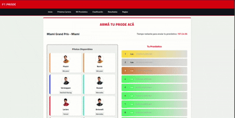

# F1 Prode

A Django-based Formula 1 prediction project.

Users can:
- Predict the results of each Grand Prix during the season (Races, Sprints, Poles).
- Earn points based on the accuracy of their predictions.
- Compete in global rankings, among friends, or within private leagues.



---

## Technologies Used

- Python 3.12
- Django 5.2
- SQLite3 (for local database)
- HTML5, CSS3 (Bootstrap or custom styles)
- JavaScript (for countdown timers, filters, etc.)

---

## Local Installation

### Prerequisites
* Python (version in .python-version)
* uv installed. You can install it by running:
```bash
curl -Ls https://astral.sh/uv/install.sh | sh
```
or by following [the official installation guide](https://docs.astral.sh/uv/#installation)

### Setting up project

#### 1. **Clone this repository**:

```bash
git clone https://github.com/SifonFelipe/F1-Prode.git
cd F1-Prode
```

#### 2. **Install dependencies**

To install all required packages directly from `pyproject.toml` (`uv.lock`), run:
```bash
uv sync
```

This will install them in a *magic virtualenv* (`uv` installs dependencies into a global cache, not a local venv)

#### **OPTIONAL** Create and use a virtual environment
If you prefer to work inside a traditional `.venv`:

```bash
uv venv
```

You can activate it like any other `.venv`:

```bash
source .venv/bin/activate
```

The virtual environment will already have all the dependencies installed during the `uv sync` step.

---
#### IMPORTANT: Running Commands

Depending on whether you're using a `.venv` or not:
* If you activated the virtual environment:

  You can run Django commands normally, for example:
  ```bash
  python manage.py runserver
  ```
* If you're not using a virtual environment:

  You must run them through `uv`:
  ```bash
  uv run manage.py runserver
  ```
  `uv run` ensures your commands use the correct environment and installed packages even without an active .venv.

---

#### 3. **Run database migrations**:

This will depend on which choice you are using (*.venv* or not).

  * If you are in a venv:
    ```bash
    python manage.py migrate
    ```
  
  * If you are not:
    ```bash
    uv run manage.py migrate
    ``` 


#### 4. **Start the development server**:

* Using `.venv`:
  
  ```bash
  python manage.py runserver
  ```

* Without `.venv`:
  ```bash
  uv run manage.py runserver
  ```


## License


This project is licensed under the MIT License.
See the LICENSE file for more information.


## Contributions

Contributions, issues, and feature requests are welcome!
Feel free to fork this repository or open a Pull Request.

## Author

* SifonFelipe

